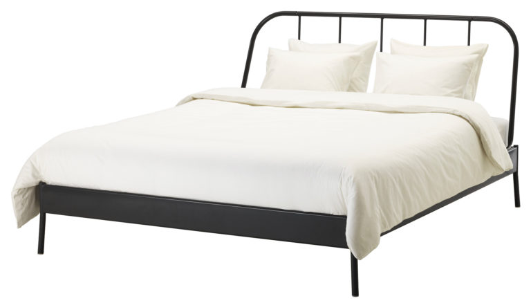
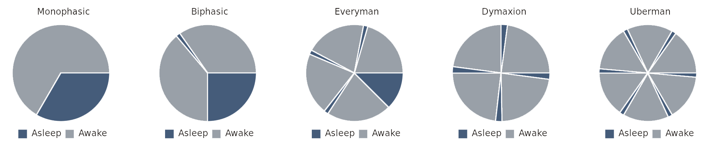

_The [previous post](https://www.erikelbieh.com/blog/Maslow-pt1/) discussed Maslow’s hierarchy of needs. Sleep is in the lowest foundational level of the hierarchy._ 

We spend more of our life asleep than most other activities. It bothers me that while there’s a word for experimenting, improving, or adjusting what someone may eat (“diet”), I am unaware of a similar word for experimenting, improving, or adjusting the way someone may sleep. To bring us closer to a solution, I have compiled my personal list of variables that I have experimented with in my attempt to improve nightly slumber.

**Get the gear:** Pillow & mattress selection

The standard essentials of most people’s bedtime routine are a pillow and mattress. If you’ve ever slept in a hotel, or at a friend’s house, or even on a sofa, you’re already aware that there is a large variety of pillows and mattresses available. Given that most people spend about 8 hours a day in contact with these items, I think it’s worth investing in quality. I found it useful to try out different pillows and mattresses in a store before deciding on something that worked best.

**Get the accessories:** Earplugs, eyemask, etc.

Sometimes it is difficult to control the surroundings around you, such as while traveling. I find it difficult to sleep well in a noisy environment, or one that is bright, so earplugs and an eyemask can go a long way. I’m sure there’s plenty of other sleep-assisting devices, but I’ll stick to these two for now.

**Choose your surroundings:** Room temperature, noise level, light removal

The previous tip was for environments you can’t control, but if you’ve got your own room, there’s a few things you can try to control. According to some online sources, the ideal temperature for sleep is around 65-70 F (18-21 C). Not surprisingly, this can vary depending on blankets, pajamas, etc.

With regards to noise level, I have found that some form of white noise helps me sleep better by blocking out noises that might happen around me at night. During the warmer months, a fan in the room can do the trick. Another option is to search online for “white noise” to find free digital white noise audio. If you happen to be a picky princess and require analog white noise instead of a digital recording, I’ve found that white noise machines exist to create that noise (without circulating air, like a normal fan would do). I eventually decided to try one of these analog white noise machines and now regard it highly.

One small tip I read about was removing or covering all light sources in your bedroom to make the room as dark as possible. This includes either unplugging or covering electronics with lit LEDs, and closing your blinds or curtains fully to prevent any street lights from entering. I do find this to help provide more consistent good sleep.

**Do the prep work:** Screen usage, reading

I find it hard to avoid screentime before bed, so I try to make the best out of it. There’s a lot of free programs and apps available (for [Windows](https://justgetflux.com/),  [Android](https://play.google.com/store/apps/details?id=com.urbandroid.lux), etc.) to automatically reduce blue light emitted from a screen after sunset. I learned that blue light is associated with sunlight and daytime, and human eyes are tuned to respond according. By using a program to remove the blue light, I like to think I’m able to get to sleep quicker on average. At the very least, it’s free and easy to try!

I have also heard many good things about reading books before bed, particularly fiction, but I have not experimented with this sufficiently to say I find this helpful. I will say that, in general, I definitely find it worthwhile to scout out books recommended by others and read a lot! Lastly, from personal experience, I can recommend avoiding exercise, caffeine, and large quantities of sugar before bed.

**Make a plan:** Monophasic, biphasic, and polyphasic

Due to the current worldwide acceptance of predetermined working hours for most employees, the majority of the world’s population aims to get their daily allowance of sleep in one continuous period. This is known as a monophasic sleep schedule, but it is not actually necessary to sleep for that amount of time continuously. A biphasic sleep schedule describes splitting that amount of time into two pieces, ideally in 90 minute increments to allow for uninterrupted sleep cycles. For example, I experimented with a 6 hour sleep period at night with a 90 minute nap in the evening, but eventually this devolved into skipping or shortening the 90 minute nap, making the schedule untenable. Polyphasic sleep is a rarer, and potentially more extreme time saving means of sleeping, but if you can make it work, more power to you!

**Weekly Extreme Exception**

While the above topic relates to a dark, sun-free environment, I thought we should shine some light on the topic (pun intended). The following plane was the first manned solar powered aircraft to circumnavigate the globe! Sure, it took over a year of individual legs to complete the feat, and a repaired battery pack, but it&#8217;s an amazing engineering feat that should pave the way for future aircraft. While there&#8217;s plenty of great video footage of it&#8217;s around-the-world trip, this clip shows a particularly dicey cross wind landing test.

