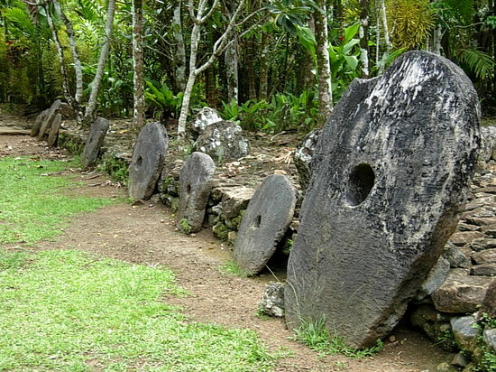

_This post is a continuation on posts about Maslow’s hierarchy of needs. See [Part 1](https://www.erikelbieh.com/blog/maslow-pt1/) and [Part 2](https://www.erikelbieh.com/blog/maslow-pt2/) for earlier details._ 

I don’t have much unique advice about how to save, make, or spend money that can’t be found in other places online. Most people in today’s society likely see money as a necessary evil in the world. But I would like to offer a perspective on how money has evolved to its current form, and how many of the steps appear to be a logical progression of civilization&#8217;s development. The view is an oversimplified one, and may have some inaccuracies, but it might help in abstracting the evolution of spending and earning money.

Step 1: DIY

A long, long time ago, before even trading was established, the world was a tough environment where nearly everything was a Do-It-Yourself (DIY) project. Need food? DIY. Water? DIY. A place to sleep? DIY. There wasn’t much specialization so each individual had to do everything.

Step 2: Trading

Eventually, when certain skillsets were developed, it made sense for one person with one skill to exchange the fruits of their labor with another person with another skill. In this manner, individuals could specialize in tasks and potentially improve their output. Trading with others to exchange certain skills and goods began.<figure id="attachment_101" aria-describedby="caption-attachment-101" style="width: 383px" class="wp-caption aligncenter">

Step 3: Intermediate step

Some skills may not easily be traded between each other and it’s likely that the subdivision of certain goods was difficult. To solve these problems and others, an intermediate holder of value came about. Cowrie shells and Yap stone money are a few of the more known examples. By imbuing certain rare items with an intrinsic value, it was possible to use these valued items as a temporary means of storing value during a trade.

Step 4: Standardization

With rare objects coming in a variety of shapes and sizes (e.g. big and small cowrie shells), a standard measurement of this intermediate value can help traders maintain consistently and avoid inaccuracies. By using pieces of rare metals of a specific weight, the first coins are produced in gold and silver. With this standardization, more formal valuation of wealth, and the possibility of banks using a standard metric for value, became possible.

Step 5: Industrialization

Industry grew and coinage became increasing popular, meaning greater numbers of coins were required. Cheaper metals were more sustainable, as they avoided potential pitfalls of precious metal coinage (for an educational aside, see the history of [reeding](https://en.wikipedia.org/wiki/Reeding)). By removing the rare metals from the coinage, the coins had no inherent value, but became the de facto standard for the intermediate step of trading.

Step 6: Digitization

Once the internet came about, it wasn’t even necessary to physically exchange coinage, currency, or checks for the exchange of value. Instead, by simply adding and subtracting “money” from digital accounts (such as with credit cards), the exchanging value between people and companies could be performed with no physical transfer of value. Since banks (and/or certain companies) were already trusted institutions, they are often tasked with managing the trust in these digital exchanges. Of course, the trust model changes slightly with cryptocurrency, but the lack of any physical value remains.

In summary, there’s some aspects of money in modern day life that is clearly very much simplified from money in its earlier stages.  And few would complain about buying every items rather than creating these items for themselves. However, one problem I ponder is whether a person in today’s modern world could even attempt to revert back to “Step 1” or event “Step 2” of the evolution of money. Would it be possible to fully avoid using modern coins and currency to live off the land? Could such a strategy be sustainable? Based on what I’ve learned of very low cost traveling (couchsurfing being the mildest form) and living off the grid, I see at least some experimentalists trying to borrow some aspects of the simpler days of society.

**Weekly Extreme Exception**

One project that would have been significantly more difficult without global economic cooperation is the International Space Station. A pressurized human habitat falling towards earth at an altitude of about 250 miles (400 km) which has been continuously inhabited since the year 2000? IT’S AMAZING! And not surprisingly, one of the most expensive constructions and scientific endeavors ever. The timelapse video below offers an amazing visual of our planet.

