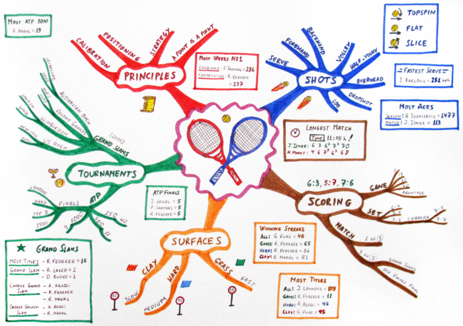

I’m often intrigued by the innocuous daily habits of others, primarily because these habits can make a major impact in the long run. One area I’ve focused on (and will never feel “done” analyzing) is managing to do lists. There’s many ways of dealing with such a simple task, but below is my current method, which continues to evolve with time.

**Big picture planning**

I consider big-picture thinking beyond the 5 year time horizon to be helpful in verifying that you’re setting directionally correct goals, but besides choosing a distant target, it’s very hard to make decisions today that you’ll agree with and follow through on after 5 years. Imagine yourself 5 years ago giving opinions and orders to yourself today. A prerequisite to setting big picture goals is knowing yourself, which is a topic unto it’s own, but I’d suggest a bucket list for those who haven’t created one yet. Let’s assume this is complete and you want to start moving in a certain direction.

**Monthly Mindmap**

I’ve found the mindmap structure (see image above) to be helpful when documenting the goals I have for the month ahead. Mindmaps are a versatile tool that can easily be adapted to capture nearly anything that comes to mind and quickly commit it to paper. I’ll group these tasks around key topics, such as “chores” or “career”, which can help filter away tasks that clearly don’t connect with useful or relevant goals. I find the difficult part is in capturing all tasks of importance. If I perform this step properly, my mind can avoid scenarios where I’m continually reminding myself to complete a certain task, which is a waste of mental energy.

**Weekly Organization**

Once the outline for the month is built, I try and take a number of tasks for each week as they arrive. Once the week’s items are chosen (requiring knowledge of the upcoming week’s schedule), I’m able to further break things down by day, turning the tasks into manageable morsels. I perform a weekly review, similar to Napoleon Hill’s concept of a Mastermind Group or Ben Franklin’s Junto, to keep myself on track and document observations. Among the questions I try to answer weekly are:

  * What are three small goals for the coming week?
  * What are three large goals for the coming week?
  * What did I learn last week?
  * What needs improvement?

The answers to these questions not only help me understand trends over time and review past events, but they also provide thought into tasks that might pass by as missed learning opportunities otherwise.

There’s plenty of strategies for handling a to do list, and it&#8217;s highly dependent on personal preference, but this is my current strategy until further improvements arise.

**Weekly Extreme Exception**

One task that was on my to do list for a while was to become competent at drone racing, or RC flying in general. That goal has been relegated to the bucket list, but I’m still amazed at the abilities that automated systems have in this arena. The aggressive maneuvers shown below demonstrate the strength of a tightly-controlled feedback loop. However, I fear that it might take a significant amount of time and investment for such projects to make an appearance outside of labs, where the lack of calibrated sensors and unreliable nature of external stimuli can prove a hindrance. Yet perhaps in several years I can let an automated control system handle the drone racing for me while I watch the fun.

