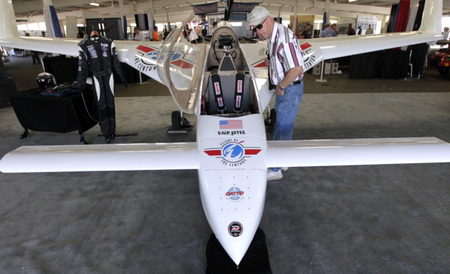
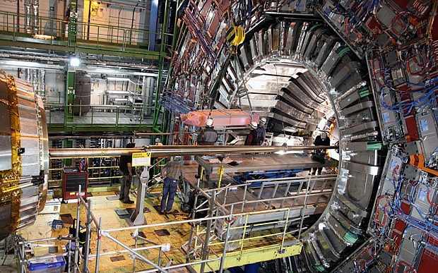
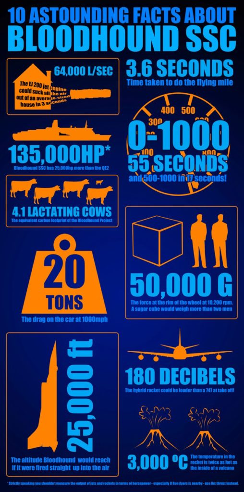

There are some engineering projects out there that are just so far fetched and absurd that I have to create a term to describe them, and I choose the word “cool”. Some technologies, like electric and autonomous vehicles, certainly have a cool factor right now, but there’s growing consensus that we’ll be seeing that technology in daily life before too long. Many of the cool projects below are one-offs that have minimal connection to a commercial product, but they are setting the bar for those that follow. I’m always interested in these half-crazy projects, so [contact me](http://erikelbieh.com/contact.html) if I missed others.

{: reversed="reversed"}

0. Yves Rossy, &#8220;Jetman&#8221;

    The dream of flight might have been achieved for the general public in the 20th century, but Yves Rossy must have decided he wasn’t satisfied with a conventional airplane. After flying a variety of jet aircraft, Yves built his own wearable wing combined with four miniature jet engines to propel him at over 150 mph. Not only does this look amazingly fun, but it hints at a future of jetpacks and individual aircraft for short distance travel. I might actually want a long commute if I could travel like this!

    

0. Chip Yates

    If you don’t know Chip’s story, his first major electric vehicle project was building a motorcycle in early 2011 (before Tesla’s Model S was on sale) and beating up on the gasoline powered competition. After riding that motorcycle while picking up nearly a dozen world records, Chip decided the same powertrain could work in a plane, and it got transplanted soon after. He got his pilot’s license just in time for the first flight, and in the coming months had to manage several dead-stick landings. He’s now working on a larger electric plane capable of crossing the Atlantic (without solar panels). Good luck Chip!

    

0. Large Hadron Collider

    The LHC might be &#8220;old&#8221; compared to the other project shown here, but it still sounds like something out of a sci-fi novel. 10 years, thousands of engineers, 17 miles of supercooled magnets, all working to accelerate sub-atomic particles to 99.999999% the speed of light. The accuracy required for the assembly and calibration of the entire instrument must have been absurd. However, there are already proposals for particle colliders that could supersede the LHC&#8217;s capabilities.

    

0. ETH Zurich Quadcopters

    While quadcopters really started taking the world by storm in 2012-2013, when they become commercially available at low cost, Raffaello D’Andrea had been working on the technology for nearly a decade. I recently had my mind blown with one of their latest developments. I had always thought a quadcopter that lost a propeller or motor would be uncontrollable for a human operator, but the team at ETH Zurich has shown that they&#8217;re capable of controlled flight with _only one_ motor and propeller! Although there are many impressive proof-of-concept demonstrations from the ETH Zurich lab, the video below shows a snapshot of quite a few.

    

0. Bloodhound SSC

    The Bloodhound SSC is undoubtedly built for just one purpose &#8211; to become the fastest land vehicle in the world. It was originally going to have a Formula 1 engine &#8211; to serve as a fuel pump for the jet engine. And the jet engine would only bring the car up to about 300-400 mph &#8211; until the rocket engine kicks in. And that rocket engine is for propelling small satellite into orbit, so the car should get over 1000 mph. The stats on this vehicle are so insane that it seems unfair to call it a car. Normally I would consider such a crazy effort to be a long shot, but the team working on Bloodhound SSC carries some key members from Thrust II SSC team, the vehicle that holds the current land speed record. Bloodhound SSC is slated to get moving in the coming year, so watch [their site](http://www.bloodhoundssc.com/) for updates.

    

**Weekly Extreme Exception**

It wouldn&#8217;t seem fair to mention all of the above examples of extreme engineering without a mention to one of the all crazies engineering feats of all time: the Apollo program. The astronauts may have ridden the rockets, but the engineers on the ground design and monitored them. If you&#8217;ve watched &#8220;The Martian&#8221; and wondered what &#8220;steely-eyed missile man&#8221; meant, here&#8217;s the man who originally received the title (for saving Apollo 12).

