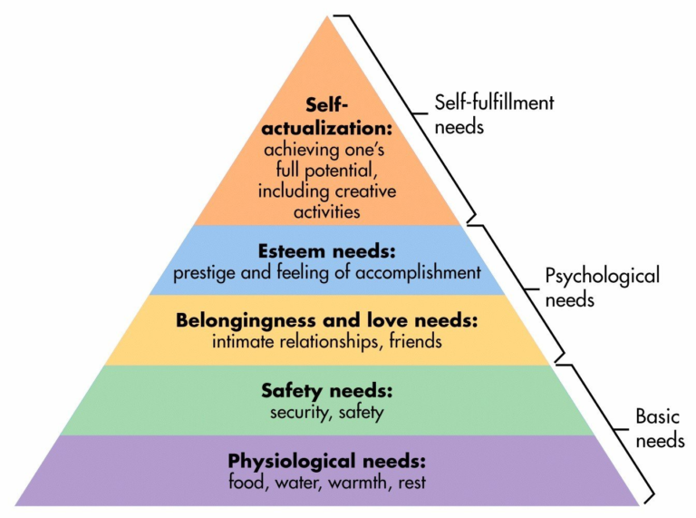

Through this series of posts, I hope to describe a few ideas that I think are useful for nearly anyone in any circumstance. The main idea is reexamination of basic fundamentals, or “building blocks”, where improvements can be leveraged for impact in many focus areas. While examining these building blocks, I’ll add in my own perspective on how some modifications or personalizations have yielded some benefits.

I’ll start with one theory that surprised me when I first heard of it: Maslow’s hierarchy of needs. Several times a year, I like to take a step back to look at the big picture. Not necessarily from the personal goals perspective of “where am I now and where am I going”, but instead asking the question if all the needs I encounter in my daily life are being met. Sometimes this question has yielded an obvious answer (e.g. lack of sleep), but at other times a less solid answer. As it turns out, the answer to this questions can be found in Maslow’s nifty pyramid.

I found that some guy named Maslow already put in the effort to not only list a large number of basic needs, but he also prioritized them. Nowadays, when I’m examining what areas of my everyday life to work on, I can zip through Maslow’s list of needs and see where I need to renew my focus.

From another perspective, when looking around the world, it’s possible to borrow insight from Maslow’s hierarchy to understand why circumstances are so difficult in certain regions of the globe. While it’s a common activity in developed nations to seek your calling in life and do what you enjoy, it can be far more difficult to focus on higher-level needs in regions where security or safety isn’t up to par, even if basic food and water is available.

Overall, I find the pyramid breakdown as a useful way of refocusing on &#8220;needs&#8221; rather than &#8220;wants&#8221;. However, despite the usage of the word “needs” in Maslow&#8217;s hierarchy, I tend to think of the top-most hierarchy as filled with “wants”, meaning I view &#8220;needs&#8221; as having increasing flexibility as the top is neared. So when you next feel the need for improvement ideas in your life, I suggest using Maslow’s hierarchy of needs as a useful starting point.

**Weekly Extreme Exception**

Over time I have begun to realize that there’s an increasing number of insanely skilled athletes out there that leave me questioning whether their videos employ special effects. Alas, I often find that when it looks too good to be CGI, the only remaining option is that it’s real. Danny MacAskill’s balance and athleticism on his custom bike shows how the human body can adapt to using any tools that are presented to it. While I would still find these tricks superb on a motorbike, I really appreciate the fact that Danny isn’t using any form of assistive propulsion.

