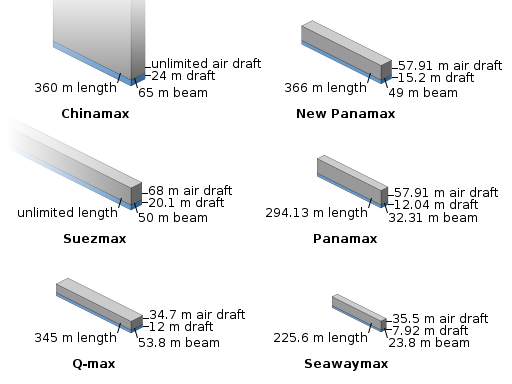

Sometimes I find it worthwhile to take a step back from everyday activities and contemplate how different life is today compared with life 100 years ago. One of the changes that I most appreciate is how the world seems to small today, not because of the internet and communications, but because of the advances made in transportation.

Take, for instance, airplanes. 100 years ago, planes were only just starting to experiment with pressurized cockpits and were finishing the transition from wooden structures to metal. Airports were rarely found, and most time airplanes just landed in an open field. Fast forward to modern day air transport where complaints can be heard about the small food portions in the meticulously designed high-tech aircraft. And the lines are considered too long in the fantastically expensive airport terminals. Sometimes, it helps to take a big picture perspective and truly appreciate how far things have come.

I’d like to take a few minutes to elaborate on how other transportation marvels have changed people’s lives around the world.

**4. Self-balancing personal transporter**  
Whether you think of a hoverboard, a Segway, or an electric unicycle, these electric self-balancing personal transporters are offering new options for last mile transport. Even 20 years ago, these creations would have appeared to have come from a science fiction novel. So far, I think these devices have been used as toys or a fancy excuse to avoid walking, but as cities become larger and limitations on car usage may arise, other personal transport may fill the void. Additionally, electric wheelchairs and other similar devices may become more common with the increasing life expectancy for people worldwide.

**3. Cargo ships**  
How do those foreign products in supermarkets get there? What mode of transport delivered your clothing from Central American or Southeast Asia? In many cases, the answer is a large cargo ship, since 90% of international trade is by sea. These ships are absolutely massive, with one of the largest class of ships, the Chinamax, able to carry 400,000 tons of iron ore across an ocean. In comparison, if we estimate an average car weighs 2 tons, then one ship could carry 200,000 cars in a single trip. That’s absurd! The massive transporters truly have changed how goods flow around the world.<figure id="attachment_108" aria-describedby="caption-attachment-108" style="width: 449px" class="wp-caption aligncenter">

**2. Supersonic plane**  
Alas, the age of supersonic commercial planes has passed for the moment, but it’s important to remember that the sound barrier was broken for the first time in 1947 – not that long ago! Bringing the NYC-London trip to below the 3 hour mark is an incredible feat. There’s many initiatives to bring back supersonic transport, but one of the hurdles is the regulations around the amount of noise that supersonic travel creates. We shall see if this problem can be overcome in the not-too-distant future!

**1. The humble automobile**  
Yes, a regular car takes first place. Why? In part because it took 10 days when horses were used to transport mail between the eastern and western coasts of the USA. The current record for driving coast-to-coast in the “Cannonball run” is under 30 hours. Nearly anyone can get access to a car in this day and age. Despite planes moving people and goods around much faster, the reliability and accessibility of the automobile has altered how people get around on a daily basis. After acclimatizing to car usage on a regular basis, it’s hard to imagine using a horse-drawn carriage for short distance travel and a train for longer trips, as was more common 100 years ago. In addition, the upcoming transition of electrification and automation in cars may provide even more changes that will move humanity forward in the next century.

**Weekly Extreme Exception**

With all this talk of transportation, I’d like to present one of the contenders in the race for eVTOL craft. The Kitty Hawk Flyer is shown in a manned flight, which demonstrates that this group of engineers has already been able to handle a number of safety and power limitations. It’s not necessarily moving around as gracefully as it could, but it’s still early days and further improvements will happen with time. The real question is if these craft have a chance to compete with cars in certain places!

